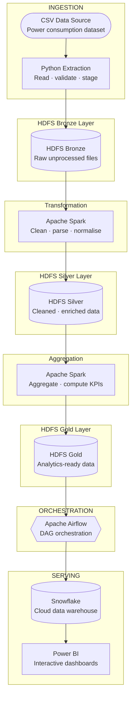
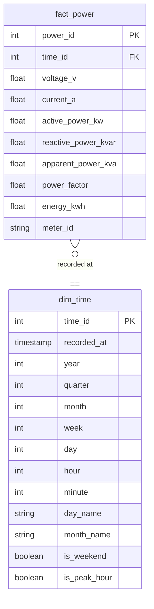

# Data Engineering Pipeline — Mermaid Diagrams

---

## 1. Architecture Diagram (Data Flow)

```mermaid
flowchart TD
    subgraph INGESTION
        A([CSV Data Source\nPower consumption dataset])
        B[Python Extraction\nRead · validate · stage]
    end

    subgraph BRONZE["HDFS Bronze Layer"]
        C[(HDFS Bronze\nRaw unprocessed files)]
    end

    subgraph TRANSFORMATION_1["Transformation"]
        D[Apache Spark\nClean · parse · normalise]
    end

    subgraph SILVER["HDFS Silver Layer"]
        E[(HDFS Silver\nCleaned · enriched data)]
    end

    subgraph TRANSFORMATION_2["Aggregation"]
        F[Apache Spark\nAggregate · compute KPIs]
    end

    subgraph GOLD["HDFS Gold Layer"]
        G[(HDFS Gold\nAnalytics-ready data)]
    end

    subgraph ORCHESTRATION
        H{{Apache Airflow\nDAG orchestration}}
    end

    subgraph SERVING
        I[(Snowflake\nCloud data warehouse)]
        J[Power BI\nInteractive dashboards]
    end

    A --> B --> C --> D --> E --> F --> G --> H --> I --> J
```

---

## 2. Data Warehouse Schema (Snowflake Schema)

```mermaid
erDiagram
  fact_power {
    int power_id PK
    int time_id FK
    float voltage_v
    float current_a
    float active_power_kw
    float reactive_power_kvar
    float apparent_power_kva
    float power_factor
    float energy_kwh
    string meter_id
  }
  dim_time {
    int time_id PK
    timestamp recorded_at
    int year
    int quarter
    int month
    int week
    int day
    int hour
    int minute
    string day_name
    string month_name
    boolean is_weekend
    boolean is_peak_hour
  }
  fact_power }o--|| dim_time : "recorded at"
```
